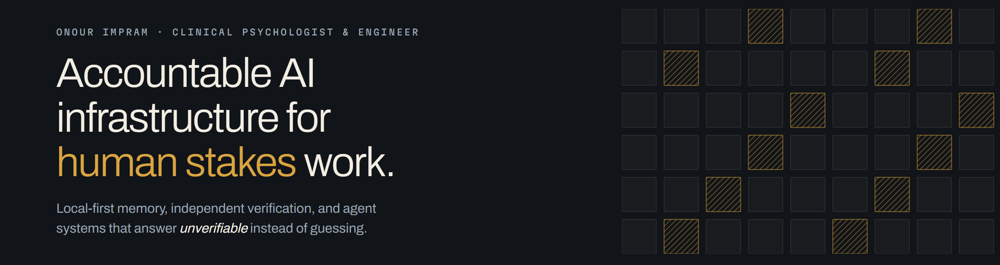

<p align="center">
  
</p>

I am a clinical psychologist with an MSc in clinical psychology and a second in counselling psychology, a PhD student, and currently training in AI engineering with IBM. I build the parts of AI systems that have to answer for themselves once the stakes are human.

The question underneath all of it: **how can a system remember, reason and act without becoming opaque, uncorrectable, or unsafe when real people depend on it?**

## What I ship

Five projects, all public, all installable or readable today.

### [mneme](https://github.com/OnourImpram/mneme) — memory you can audit

Local-first memory for Claude Code and MCP clients, where Markdown stays the source of truth. No model runs on the Stop path. CI fails the build if a lifecycle hook imports the network. Retrieval is held to a locked benchmark baseline, and a pull request that drops below it does not merge.

```bash
pipx install mneme-cc-plugin && mneme install
```

### [Mergen Verdict](https://github.com/OnourImpram/mergen) — verification that is allowed to say no

An executor reporting *done* has made a claim, not a proof. Mergen re-derives the evidence from the repository itself, applies a risk floor that cannot be downgraded, and returns one of `pass`, `conditional_pass`, `fail` or `unverifiable`. An `unverifiable` never becomes a `pass`, and it never runs the next stage.

```bash
pip install mergen-verdict
```

Through 2.1.1 the wheel declared only its two top-level modules and could not carry the verification scripts, and this page said so. 2.1.2 packages them, and a checkout still takes precedence over the packaged copy, so an editable clone runs the code you are editing.

### [routeledger](https://github.com/OnourImpram/routeledger) — what actually served your session

The model answering your Claude Code turn can change without an error: an alias override, the plan-mode boundary, a safety fallback. Work continues and nothing tells you. Your transcript already recorded it; this reads it back. Read-only, offline, writes nothing.

```bash
npx routeledger
```

### [VocationOS](https://github.com/OnourImpram/vocation-os) — decisions that need a human first

A local-first daemon for career actions that cannot be undone — send, submit, publish. Claim graphs, scoped human approval, reversibility gates, and an append-only ledger that records an action as done only against a trusted receipt. It ships no production auto-apply adapter, deliberately.

### [Claude Code for Social Scientists](https://github.com/OnourImpram/claude-code-for-social-scientists) — the handbook

A bilingual Turkish and English guide for researchers who want agentic tools without surrendering methodology, authorship transparency, or a reference list they can defend in review.

## Why a clinician builds infrastructure

Clinical training is, in large part, training to act under uncertainty without pretending it is absent. You learn to keep what you observed separate from what you inferred, to write down which is which, and to stay answerable for the difference long after the session ends.

Most of what I build is that habit turned into code. It is why these tools would rather return `unverifiable` than a confident guess, and why the interesting engineering usually sits in what the system refuses to assert.

## If you would rather check than believe

Every project carries CI, a license, tagged releases and a changelog. My site is [onourimpram.com](https://onourimpram.com), and my academic identity is [ORCID 0000-0003-1076-3928](https://orcid.org/0000-0003-1076-3928).

Outside my own repositories there is an open fix in [pytest-cov](https://github.com/pytest-dev/pytest-cov/pull/751), an open skill contribution to [anthropics/skills](https://github.com/anthropics/skills/pull/1147), and PowerShell support opened against [fableplan](https://github.com/tylerlaprade/fableplan/pull/1). Three of those are still awaiting review, which is the honest status.

Where a claim could not be verified, the documentation says so rather than rounding it up. Mergen's README states which install path its own published wheel cannot support; routeledger's changelog lists four over-claims that were removed from it.

If one of these is useful, starring it tells me which to keep working on.
